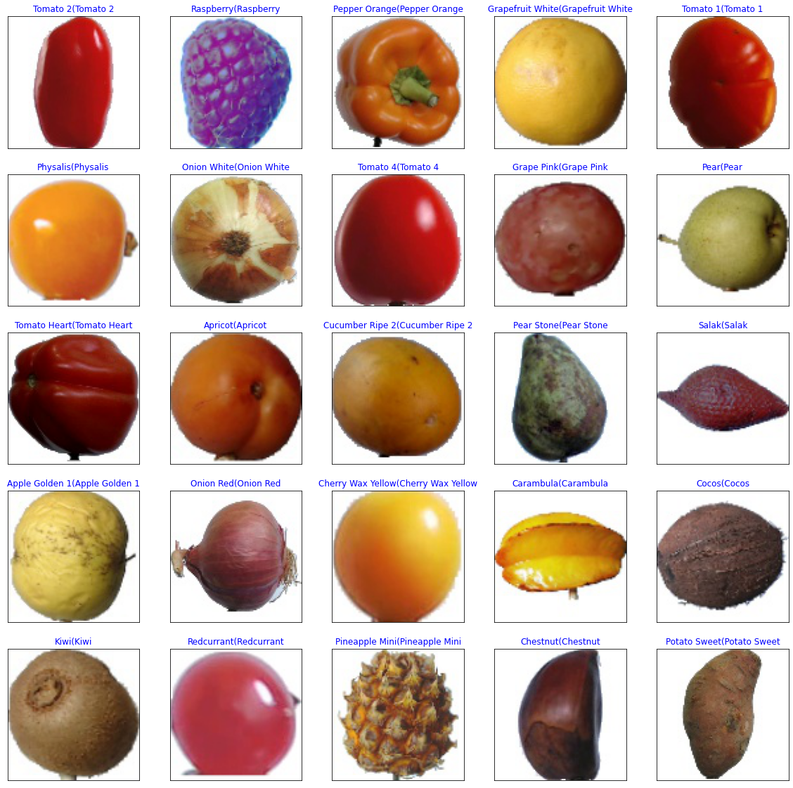

# **README for CNN-Based Image Classification Notebook**

## **Overview**
This project implements a convolutional neural network (CNN) for image classification using the Keras library. The notebook demonstrates the end-to-end workflow of building, training, and evaluating a CNN for classifying images, including preprocessing, exploratory data analysis (EDA), and model training.

---

## **Key Sections**

### **1. Data Preprocessing**
- **Image Augmentation and Rescaling:**
  - The `ImageDataGenerator` is used for image rescaling (1./255) and augmentations such as:
    - Shearing
    - Zooming
    - Horizontal flipping
- **Dataset Preparation:**
  - Images are loaded into training, validation, and testing sets.
  - Images are converted to NumPy arrays and normalized for model input.

### **2. Exploratory Data Analysis (EDA)**
- **Dataset Visualization:**
  - Sample images are displayed to understand dataset characteristics.
- **Dataset Structure:**
  - Class labels are explored for insights into distribution and balance.

### **3. Model Training**
- **Architecture:**
  - A CNN with the following components:
    - Multiple convolutional layers with ReLU activation.
    - Pooling layers (max pooling).
    - Batch normalization for stabilizing and speeding up training.
    - Dropout for regularization to prevent overfitting.
  - Fully connected dense layers leading to the output layer with softmax activation.
- **Compilation:**
  - Loss function: `categorical_crossentropy`
  - Optimizer: `Adamax`
  - Metrics: Accuracy
- **Training:**
  - The model is trained using the `fit_generator` method to leverage data augmentation.
  - Performance metrics are logged during training for analysis.

### **4. Visualizations**
- **Model Predictions:**
  - Predictions on test data are compared against true labels for validation.
     
---

## **Results and Observations**
- The model demonstrates reasonable accuracy on the test dataset.
- Data augmentation significantly enhances model generalization on unseen data.
- Visualizations provide clarity on preprocessing effects and prediction accuracy.

---

## **Next Steps and Recommendations**
- **Enhancements:**
  - Experiment with deeper CNN architectures or pre-trained models (e.g., ResNet, VGG16).
  - Perform hyperparameter tuning for learning rate, batch size, and dropout rate.
- **Further Analysis:**
  - Implement Grad-CAM or similar techniques to visualize feature importance.
  - Explore misclassified examples to identify model limitations.

---

## **Dependencies**
- Python (3.x)
- TensorFlow and Keras
- NumPy, Matplotlib

---

For any questions or additional details, refer to the notebook or contact the author.
